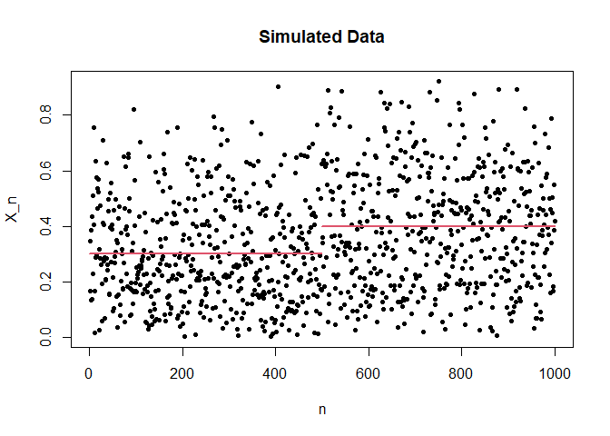
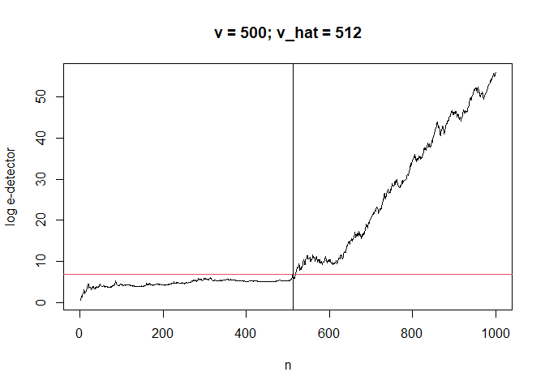
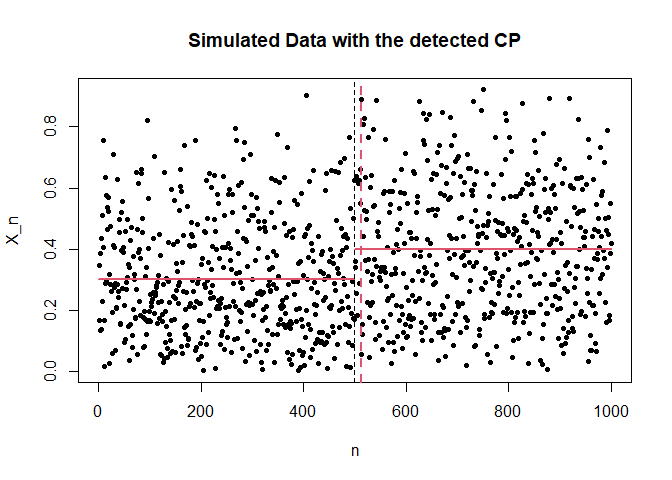

<!-- README.md is generated from README.Rmd. Please edit that file -->

# STCP: Sequential Test and Change-Point detection algorithms based on E-values / E-detectors

<!-- badges: start -->

[](https://github.com/shinjaehyeok/STCP/actions)
<!-- badges: end -->

STCP is a R package built to run nonparametric sequential tests and
online change point detection algorithms in \[CITE SRR 21’ and SRR
22’\].

## Installation

You can install the development version of STCP from
[GitHub](https://github.com/) with:

``` r
# install.packages("devtools")
devtools::install_github("shinjaehyeok/STCP")
```

## Example

Suppose we have a stream of observations
*X*<sub>1</sub>, *X*<sub>2</sub>, … ∈ \[0,1\]. Before an unknown
change-point *ν*, each pre-change observation has mean less than or
equal to 0.3. But after the change-point *ν*, each post-change
observation has mean larger than 0.3.

``` r
set.seed(1)
library(STCP)
# Generate a stream of observations
# For simplicity, we use beta distributions to generate samples
max_sample <- 1000L
nu <- 500L
x_vec <- numeric(max_sample)
x_vec[1:nu] <- rbeta(nu, 1.5, 3.5) # Pre-change dist: B(1.5, 3.5)
x_vec[seq(nu+1, max_sample)] <- rbeta((max_sample - nu), 2, 3) # Post-change dist: B(2,3)
m_pre <- 0.3
m_post <- 0.4
plot(1:max_sample, x_vec, pch=20, 
     xlab = "n", ylab = "X_n", main = "Simulated Data")
```



Below, we compute a mixture e-detectors by which we can infer when the
change of the mean happened.

``` r
alpha <- 1e-3 # Inverse of target ARL
m_pre <- 0.3 # Upper bound of mean of pre-change observations
delta_lower <- 0.01  # Guess on the minimum gap between pre- and post-change means
stcp_model <- build_stcp_bounded(alpha, m_pre, delta_lower)

# Compute mixture of SR-type e-detectors.
mix_SR_bounded <- run_stcp(x_vec, stcp_model)
mix_SR_stop <- mix_SR_bounded$stopped_ind

# Printing summary
print(mix_SR_bounded)
#> STCP Run:
#> - Num. of new obs:  1000 
#> - Stopped index:  512 
#> 
#> STCP Model:
#> - Family:  Bounded (sub-E based) 
#> - alpha:  0.001 
#> - is_test:  FALSE 
#> - Num. of mixing components:  241 
#> - Obs. have been passed:  1000 
#> - delta_lower:  0.01 
#> - delta_upper:  0.7 
#> - bound_lower:  0 
#> - bound_upper:  1 
#> - var_lower:  0 
#> - var_upper:  0.25

# Plot 
plot(mix_SR_bounded, main = paste0("v = ", nu, "; v_hat = ",mix_SR_stop))
```



``` r
plot(1:max_sample, x_vec, pch=20, 
     xlab = "n", ylab = "X_n", main = "Simulated Data with the detected CP")
lines(x = c(0,nu), y = c(0.3,0.3), col = 2, lwd = 2)
lines(x = c(nu,max_sample), y = c(0.4,0.4), col = 2, lwd =2 )
abline(v = nu, col = 1, lty = 2)
abline(v = mix_SR_stop, col = 2, lty = 2, lwd = 2)
```


<!-- You'll still need to render `README.Rmd` regularly, to keep `README.md` up-to-date. `devtools::build_readme()` is handy for this.  -->
